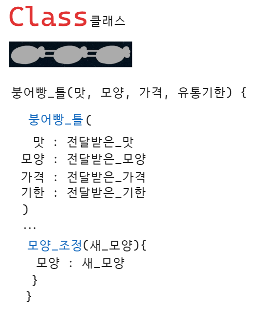
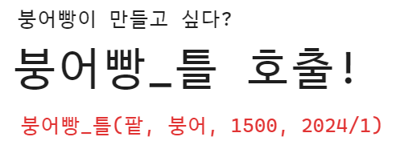

# 객체 지향 프로그래밍

절차지향 언어는 C언어가 대표적이였다. 절차지향이라고 한다면 어떤 프로그램을 만들때 순차적인 순서로 작업하는걸 말한다.

절차를 따라가다가 함수를 만나면 쭉쭉 실행되고 다시 돌아와서 라인이 실행되는걸 반복했는데 코드를 볼때 아주 직관적이었다.

근데 점점 코드가 100줄 1000줄 하던게 10만줄 100만줄이 되니까 프로그램이 점점 커지고 복잡해졌고, 유지보수가 쉽지가 않아서 객체 지향 프로그래밍을 선택하는게 좋다.

C언어의 장점을 그대로 가져다가 객체 지향 한스푼 끼얹어가지고 C++ 가 되는 것.

예전에는 10만줄 100만줄 있었다면 객체 지향으로 넘어오면서 객체가 생겨, 객체 안에는 각 개체만의 특징 코드가 들어가 있다.

하나의 큰 프로그램으로 만드는 느낌이 아닌 여러개의 프로그램으로 조각조각 나누어 만들고, 객체끼리 소통라인을 뚫려있게끔 하며, 기능이 필요하면 물어보고 답변만 받는 형식.

즉 객체끼리 소통을 하는 것이라고 할 수 있다.

예를 들어, 요리사랑 서빙이 있다고 가정했을때 서로 몰라도 되는데, 만약 주문이 들어오면 소통라인이 뚫려있으니 위 그림처럼 "A 세트 주문이야" 하고 요리사한테 알려주기만 하면 되고, 요리사도 음식만 서빙으로 건네주게 되면 끝이다.

여기서 볼 수 있듯이 두 객체가 남남이라는 건데 각자의 역할이 있다는 것이다. 절차지향은 한 가족이면 객체지향은 남남.

## 객체 지향의 장점이 뭘까?

OOP ( Object - Oriented Programming )

1. 모듈화 : 객체 들이 각각 독립적으로 분할되어 있으니 프로그래머끼리 협업해서 따로 개발하기가 쉬워진다.
2. 디버깅 : 프로그램에 에러가 있다고 하면, 전체를 고치는게 아니라 문제가 있는 코드만 고치면 되서 디버깅 하기 편해진다.
3. 확장성 : 무언가 기능을 업데이트 할 일이 생겼을 때, 절차지향은 영향가는 부분을 찾아서 고쳐줘야했지만 객체지향은 업데이트 할 객체를 찾아서 업데이트를 하면 되서 다른 객체의 영향을 받을일이 없어 관리가 쉬워진다.
4. 코드 재사용 : 다른 프로그램을 만들때도 이전에 만들어뒀던 객체를 사용하는 일이 생겨서, 코드 재사용이 좋아져서 프로그램의 크기가 커지는것에 대해 무섭지 않게 되었다.

## Object

`객체` 즉 `Object`에는 데이터가 있고, 그 데이터를 조작할 수 있는 메서드가 있다.

붕어빵을 예시로 두고 이해해보자!

붕어빵이라는 객체가 있으면 데이터와 메서드가 있을텐데 그림을 참고해보자.

## Class

그렇다면 객체는 어떻게 만들어지는걸까?

붕어빵은 틀이 있어야한다. 그림과 같은 틀에서 객체를 만들수 있는데 붕어빵을 만들고 싶다?

붕어빵_틀 호출을 해주면 된다! -> `붕어빵_틀(팥, 붕어, 1500, 2024/1)`

이 틀을 `Class`라고 부른다.

이 클래스는 객체의 설계도, 제조기라고 볼 수 있다. 

## Instance

만들어진 붕어빵 오브젝트를 `인스턴스`라고 한다.

인스턴스의 속성은 만들때 건네주었듯이 팥, 붕어, 1500, 2024/1이 된다.

메서드를 통해 속성값을 바꿀 수도 있다.

## constructor

붕어빵 틀이 호출이 될 때, 처음으로 실행되는 함수인데, 생성시 초기에 실행되어 기본 값들을 설정해주는 함수를 `생성자`라고 한다.

전달받은 초기값들을 세팅해주는 함수라고 보면 된다!

## SuperClass & SubClass

이 붕어빵 틀이 너무 좋아서, 이 원리를 기반으로 해서 국화빵 틀을 만들 수 있다.

기본 붕어빵 속성에다가 `색깔`을 넣어서 국화빵 틀을 만들었다.

기존의 클래스에서 몇가지 기능을 추가해서 새로운 클래스를 만드는 것 이걸 `상속`이라고 한다.

이렇게 붕어빵은 '부모클래스'가 되고 국화빵은 붕어빵의 '자식클래스'라고 부를 수 있다.

## Override

붕어빵 틀에서 상속받은 모양 조정 메서드를 국화빵에 맞춰 고쳤는데, 이를 부모 클래스로 부터 메서드를 `오버라이드`하였다. 라고 한다. (상속받은 메서드를 상황에 맞게 바꾸었다)

##  Overlode

호출할 수 있는 메서드를 하나 추가하려고 할때, 받는 인자에 새_색깔을 추가한다고 가정하면, 국화빵의 모양만 바꾸고싶다면 첫번째 `모양_조정`만 호출이 되겠지만, 색깔까지 추가하게되면 두번째 `모양_조정`이 호출이 된다.

어떤 값을 가지고 메서드를 호출하냐에 따라 함수 호출이 달라진다. 이걸 `Overload`라고 한다.

## Polymorhism

붕어빵 객체가 있고, 국화빵 객체가 있을때, 붕어빵이 가진 `모양_조정`메서드에 잉어를 넣어 호출하면 잉어로 바뀌고 국화빵에 있는 `모양_조정`에 국화와 빨강을 넣으면 모양과 색이 바뀐다.

두 개의 객체가 같은 메서드를 호출하지만 다르게 동작하는 것을 `Polymorhism` 즉 `다형성`이라고 부른다.

## 객체지향 용어 정리

- 오브젝트 (Object) : 데이터와 기능들을 함께 포함하는 개체
- 클래스 (Class) : 오브젝트를 생성하기 위한 틀 / 설계도
- 인스턴스 (Instance) : 특정 클래스를 기반으로 생성된 오브젝트
- 생성자 (Constructor) : 클래스로부터 객체를 생성할 때 초기화 해주는 메소드
- 부모 클래스 (Superclass) - 다른 클래스가 상속받을 기본 클래스
- 자식 클래스 (Subclass) - 부모 클래스를 상속받아 확장 또는 수정된 클래스
- 오버라이드 (Override) - 자식 클래스에서 부모 클래스의 메서드를 재정의하는 것
- 오버로드 (Overload) - 동일한 이름의 메서드나 생성자를 여러 개 정의 하는 것
- 다형성 (Polymorhism) - 여러 객체가 동일한 인터페이스나 메서드를 가지지만 다르게 동작하는 특성

